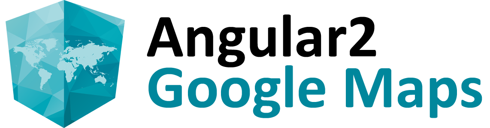

[](https://angular-maps.com/)

# angular2-google-maps

Angular2 components for Google Maps.
This project is currently in alpha state. Please do not use this in production.

[Website](https://angular-maps.com/) | [Demo](http://plnkr.co/edit/YX7W20?p=preview) | [Forum](https://groups.google.com/forum/#!forum/angular2-google-maps) | [Chat](https://gitter.im/SebastianM/angular2-google-maps) | [API Documentation](https://angular-maps.com/docs/api/latest/ts/) | [Twitter](https://twitter.com/Sebamueller)

-----

[](https://travis-ci.org/SebastianM/angular2-google-maps) [](https://gitter.im/SebastianM/angular2-google-maps?utm_source=badge&utm_medium=badge&utm_campaign=pr-badge&utm_content=badge) [](http://badge.fury.io/js/angular2-google-maps)
[](https://npmjs.org/package/angular2-google-maps)

## Playing with angular2-google-maps

If you just want to play with `angular2-google-maps` and don't want to set up a full project, you can use the following Plunker. It has all the dependencies to play with Angular2, Typescript and of course `angular2-google-maps`:

[&raquo; Play with angular2-google-maps on Plunker](http://plnkr.co/edit/YX7W20?p=preview)

## Installation

angular2-google-maps gets shipped via the Node Package Manager. So make sure that you have [NodeJS](https://nodejs.org) installed.

  You can install the package with the following command:

```shell
npm install angular2-google-maps
```

You should also checkout the [Getting started](https://angular-maps.com/docs/getting-started.html#package-installation) guide for further information.
