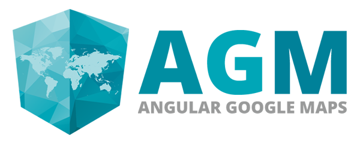

[](https://angular-maps.com/)

# AGM - Angular Google Maps

Angular 2+ components for Google Maps. (Previously known as angular2-google-maps)

-----

**CAUTION:** The project name has changed from `angular2-google-maps` maps to `AGM - Angular Google Maps` because [#itsJustAngular](http://angularjs.blogspot.de/2017/01/branding-guidelines-for-angular-and.html) and we want to support all upcomming Angular versions.

Old package name: `angular2-google-maps`  
New package name: `@agm/core`

**==> Please see the [CHANGELOG.md](CHANGELOG.md) file for more migration details.**

----

[Website](https://angular-maps.com/) | [Demo](http://plnkr.co/edit/YX7W20?p=preview) | [Chat](https://gitter.im/SebastianM/angular2-google-maps) | [API Documentation](https://angular-maps.com/docs/api/latest/ts/) | [Twitter](https://twitter.com/Sebamueller)

-----

[](https://travis-ci.org/SebastianM/angular-google-maps) [](https://gitter.im/SebastianM/angular2-google-maps?utm_source=badge&utm_medium=badge&utm_campaign=pr-badge&utm_content=badge) [](https://www.npmjs.com/package/@agm/core) [](#contributors)

| Package                               | Downloads                                                                       |
|---------------------------------------|---------------------------------------------------------------------------------|
| New package name @agm/core            |                        |
| Old package name angular2-google-maps |  |
---

## Playing with AGM (Angular Google Maps)

If you just want to play with AGM and don't want to set up a full project, you can use the following Plunker. It has all the dependencies to play with Angular, Typescript and of course `AGM`:

[&raquo; Play with Angular Google Maps on Plunker](http://plnkr.co/edit/YX7W20?p=preview)

## Installation

`AGM` gets shipped via the Node Package Manager. So make sure that you have [NodeJS](https://nodejs.org) installed.

  You can install the package with the following command:

```shell
npm install @agm/core
```

You should also checkout the [Getting started](https://angular-maps.com/guides/getting-started/) guide for further information.

## Contributors

Thanks goes to these wonderful people ([emoji key](https://github.com/kentcdodds/all-contributors#emoji-key)):

<!-- ALL-CONTRIBUTORS-LIST:START - Do not remove or modify this section -->
| [<br /><sub>Sebastian Müller</sub>](http://twitter.com/Sebamueller)<br />[💬](#question-SebastianM "Answering Questions") [🐛](https://github.com/SebastianM/angular-google-maps/issues?q=author%3ASebastianM "Bug reports") [💻](https://github.com/SebastianM/angular-google-maps/commits?author=SebastianM "Code") | [<br /><sub>Lazar Ljubenović</sub>](https://github.com/lazarljubenovic)<br />[💬](#question-lazarljubenovic "Answering Questions") [🐛](https://github.com/SebastianM/angular-google-maps/issues?q=author%3Alazarljubenovic "Bug reports") [💻](https://github.com/SebastianM/angular-google-maps/commits?author=lazarljubenovic "Code") | [<br /><sub>Brian Singer</sub>](http://localpro.me)<br />[💬](#question-brian-singer "Answering Questions") [💻](https://github.com/SebastianM/angular-google-maps/commits?author=brian-singer "Code") [📖](https://github.com/SebastianM/angular-google-maps/commits?author=brian-singer "Documentation") [💡](#example-brian-singer "Examples") | [<br /><sub>Alex Weber</sub>](https://twitter.com/alexweber15)<br />[💻](https://github.com/SebastianM/angular-google-maps/commits?author=alexweber "Code") | [<br /><sub>parmod-arora</sub>](https://github.com/parmod-arora)<br />[💻](https://github.com/SebastianM/angular-google-maps/commits?author=parmod-arora "Code") | [<br /><sub>Jinder</sub>](http://kangaroom.net/)<br />[💻](https://github.com/SebastianM/angular-google-maps/commits?author=jinder "Code") | [<br /><sub>Andreas Rammhold</sub>](https://github.com/andir)<br />[💻](https://github.com/SebastianM/angular-google-maps/commits?author=andir "Code") |
| :---: | :---: | :---: | :---: | :---: | :---: | :---: |
| [<br /><sub>Toshiyuki Ichige</sub>](https://github.com/TSHiYK)<br />[💻](https://github.com/SebastianM/angular-google-maps/commits?author=TSHiYK "Code") | [<br /><sub>staticint</sub>](https://github.com/staticint)<br />[💻](https://github.com/SebastianM/angular-google-maps/commits?author=staticint "Code") | [<br /><sub>Tim</sub>](http://www.ghostmole.com)<br />[💻](https://github.com/SebastianM/angular-google-maps/commits?author=Tempus35 "Code") | [<br /><sub>Rafał</sub>](https://github.com/rafalh)<br />[💻](https://github.com/SebastianM/angular-google-maps/commits?author=rafalh "Code") | [<br /><sub>José Luis Di Biase</sub>](http://www.camba.coop)<br />[💻](https://github.com/SebastianM/angular-google-maps/commits?author=josx "Code") | [<br /><sub>Jordan Frankfurt</sub>](https://github.com/JFrankfurt)<br />[💻](https://github.com/SebastianM/angular-google-maps/commits?author=JFrankfurt "Code") | [<br /><sub>DominikAngerer</sub>](https://dominikangerer.com)<br />[💻](https://github.com/SebastianM/angular-google-maps/commits?author=DominikAngerer "Code") |
| [<br /><sub>Carl</sub>](https://github.com/carl09)<br />[💻](https://github.com/SebastianM/angular-google-maps/commits?author=carl09 "Code") | [<br /><sub>msterba</sub>](https://github.com/msterba)<br />[💻](https://github.com/SebastianM/angular-google-maps/commits?author=msterba "Code") | [<br /><sub>B</sub>](https://github.com/b264)<br />[💻](https://github.com/SebastianM/angular-google-maps/commits?author=b264 "Code") | [<br /><sub>Jim</sub>](http://jimulle.com)<br />[💻](https://github.com/SebastianM/angular-google-maps/commits?author=jimulle "Code") | [<br /><sub>Demian Holderegger</sub>](https://github.com/demianh)<br />[💻](https://github.com/SebastianM/angular-google-maps/commits?author=demianh "Code") | [<br /><sub>Devin Despain</sub>](https://github.com/dangerdespain)<br />[💻](https://github.com/SebastianM/angular-google-maps/commits?author=dangerdespain "Code") | [<br /><sub>IlianSchokkaert</sub>](http://www.juniortoinfinity.com/)<br />[💻](https://github.com/SebastianM/angular-google-maps/commits?author=IlianSchokkaert "Code") |
| [<br /><sub>svarzee</sub>](https://github.com/svarzee)<br />[💻](https://github.com/SebastianM/angular-google-maps/commits?author=svarzee "Code") | [<br /><sub>Goran Spasojevic</sub>](http://gorango.me)<br />[💻](https://github.com/SebastianM/angular-google-maps/commits?author=gorango "Code") |
<!-- ALL-CONTRIBUTORS-LIST:END -->

This project follows the [all-contributors](https://github.com/kentcdodds/all-contributors) specification. Contributions of any kind welcome!